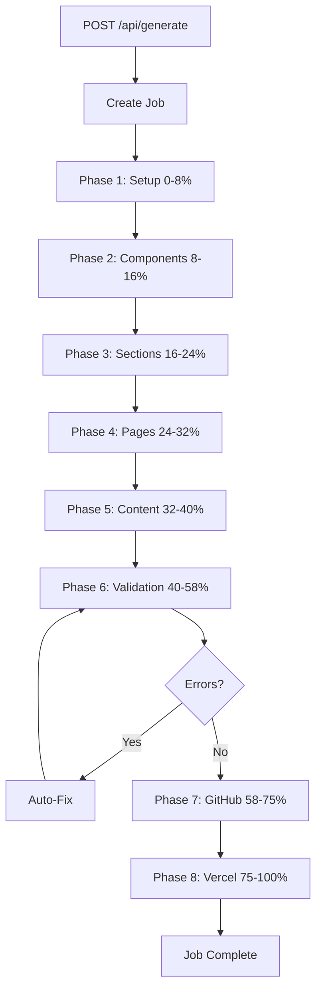

# Architecture Modulaire - SaaS Generator v3

## 🎯 Objectif

Remplacer le prompt monolithique par **5 phases séquentielles** pour une génération plus fiable, maintenable et enrichie.

## 📊 Vue d'ensemble

### Avant (Monolithique)
```
┌─────────────────────────────────────┐
│  UN SEUL PROMPT GÉANT (700+ lignes) │
│  - Tout mélangé                      │
│  - Difficile à maintenir             │
│  - Impossible de régénérer une phase │
└─────────────────────────────────────┘
```

### Après (Modulaire)
```
┌─────────────────────────────────┐
│  Phase 1: Setup                  │  (0-8%)
│  - Structure projet              │
│  - Configuration complète        │
└─────────────────────────────────┘
            ↓
┌─────────────────────────────────┐
│  Phase 2: Components UI          │  (8-16%)
│  - Button, Input, Card           │
│  - Accordion, Tabs               │
│  - Tous les états + animations   │
└─────────────────────────────────┘
            ↓
┌─────────────────────────────────┐
│  Phase 3: Sections               │  (16-24%)
│  - Hero, Stats, Services         │
│  - Testimonials, FAQ, CTA        │
└─────────────────────────────────┘
            ↓
┌─────────────────────────────────┐
│  Phase 4: Pages & Layout         │  (24-32%)
│  - Header, Footer                │
│  - ContactForm multi-étapes      │
│  - Pages légales                 │
└─────────────────────────────────┘
            ↓
┌─────────────────────────────────┐
│  Phase 5: Content & SEO          │  (32-40%)
│  - JSON-LD schemas               │
│  - Metadata SEO                  │
│  - Sitemap, robots.txt           │
└─────────────────────────────────┘
            ↓
┌─────────────────────────────────┐
│  Phase 6: Validation             │  (40-58%)
│  - Boucle auto-fix               │
└─────────────────────────────────┘
            ↓
┌─────────────────────────────────┐
│  Phase 7: GitHub                 │  (58-75%)
│  - Publication repository        │
└─────────────────────────────────┘
            ↓
┌─────────────────────────────────┐
│  Phase 8: Vercel                 │  (75-100%)
│  - Déploiement production        │
└─────────────────────────────────┘
```

## 📁 Structure des fichiers

```
app/
├── agents/
│   ├── modular/                    # ✨ NOUVEAU
│   │   ├── __init__.py            # Exports
│   │   ├── phase1_setup.py        # Setup + Config
│   │   ├── phase2_components.py   # Composants UI
│   │   ├── phase3_sections.py     # Sections homepage
│   │   ├── phase4_pages.py        # Pages + Layout
│   │   └── phase5_content.py      # SEO + Metadata
│   │
│   ├── code_generator.py          # ❌ ANCIEN (monolithique)
│   ├── site_validator.py          # ✅ Conservé
│   ├── github_publisher.py        # ✅ Conservé
│   └── vercel_deployer.py         # ✅ Conservé
│
├── services/
│   ├── generator.py               # ❌ ANCIEN (monolithique)
│   └── generator_modular.py       # ✨ NOUVEAU (5 phases)
│
└── api/
    └── routers.py                 # À mettre à jour
```

## 🔧 Détail des Phases

### Phase 1: Setup (0-8%)
**Fichier**: `app/agents/modular/phase1_setup.py`

**Responsabilités**:
- Créer `package.json` avec TOUTES les dépendances
- Créer `tailwind.config.js` avec palette complète (50-900)
- Créer `next.config.mjs` optimisé
- Créer `tsconfig.json` strict mode
- Créer structure de dossiers complète
- Créer `globals.css` avec classes utilitaires
- Exécuter `npm install`

**Fichiers créés**:
- `package.json`
- `tailwind.config.js`
- `next.config.mjs`
- `tsconfig.json`
- `postcss.config.mjs`
- `.eslintrc.json`
- `.gitignore`
- `app/globals.css`
- Tous les dossiers (app/, components/, lib/, public/, types/)

### Phase 2: Components UI (8-16%)
**Fichier**: `app/agents/modular/phase2_components.py`

**Responsabilités**:
- Créer 5 composants UI de base
- Intégrer Framer Motion
- Tous les états (hover, active, disabled, loading)
- Accessibilité complète (ARIA, keyboard)
- TypeScript strict

**Composants créés**:
- `components/ui/Button.tsx` - 5 variants, tous sizes
- `components/ui/Input.tsx` - Label, error, helper text, icons
- `components/ui/Card.tsx` - 4 variants avec animations
- `components/ui/Accordion.tsx` - FAQ avec smooth animations
- `components/ui/Tabs.tsx` - Interface à onglets
- `lib/utils.ts` - Helper cn() pour classes Tailwind
- `components/ui/index.ts` - Export centralisé

### Phase 3: Sections (16-24%)
**Fichier**: `app/agents/modular/phase3_sections.py`

**Responsabilités**:
- Créer toutes les sections homepage
- Utiliser les composants de Phase 2
- Animations scroll triggers
- Responsive mobile-first

**Sections créées**:
- `components/sections/Hero.tsx` - Hero avec CTA + trust badges
- `components/sections/Stats.tsx` - Chiffres clés animés
- `components/sections/Services.tsx` - Grille services avec cards
- `components/sections/Testimonials.tsx` - Témoignages clients
- `components/sections/FAQ.tsx` - Questions fréquentes
- `components/sections/FinalCTA.tsx` - Appel à l'action final
- `components/sections/index.ts` - Export centralisé

### Phase 4: Pages & Layout (24-32%)
**Fichier**: `app/agents/modular/phase4_pages.py`

**Responsabilités**:
- Créer layout complet (Header, Footer)
- Créer formulaire de contact multi-étapes
- Créer toutes les pages
- Navigation responsive

**Fichiers créés**:
- `components/layout/Header.tsx` - Navigation + menu mobile
- `components/layout/Footer.tsx` - Footer complet
- `components/forms/ContactForm.tsx` - Multi-étapes avec validation Zod
- `app/page.tsx` - Homepage assemblant toutes les sections
- `app/layout.tsx` - Root layout avec metadata
- `app/(pages)/mentions-legales/page.tsx`
- `app/(pages)/politique-confidentialite/page.tsx`

### Phase 5: Content & SEO (32-40%)
**Fichier**: `app/agents/modular/phase5_content.py`

**Responsabilités**:
- Créer tous les schemas JSON-LD
- Créer sitemap.xml
- Créer robots.txt
- Optimiser metadata SEO
- PWA manifest

**Fichiers créés**:
- `components/seo/StructuredData.tsx` - Tous les schemas (LocalBusiness, Organization, Service, Breadcrumb)
- `public/sitemap.xml`
- `public/robots.txt`
- `public/manifest.json`
- `app/api/contact/route.ts` - API endpoint pour formulaire
- `README.md` - Documentation complète
- `app/layout.tsx` mis à jour avec metadata complètes

## 🚀 Workflow complet



## 🎁 Avantages

### ✅ Maintenabilité
- Chaque phase dans son propre fichier
- Facile de modifier une phase sans toucher aux autres
- Code organisé et lisible

### ✅ Fiabilité
- Phases plus courtes = moins d'erreurs
- Possibilité de régénérer UNE phase si erreur
- Meilleure gestion des erreurs

### ✅ Enrichissement
- Chaque prompt peut être PLUS détaillé
- Tous les détails du monolithique CONSERVÉS
- Même AMÉLIORÉS avec plus de spécifications

### ✅ Testabilité
- Test de chaque phase indépendamment
- Debug plus facile
- Logs plus clairs

## 📝 Migration

### Étape 1: Tester localement
```bash
# Utiliser generator_modular.py au lieu de generator.py
# Modifier app/api/routers.py pour importer GeneratorServiceModular
```

### Étape 2: Comparer les résultats
- Générer un site avec version monolithique
- Générer le même site avec version modulaire
- Comparer les fichiers générés

### Étape 3: Basculer en production
```bash
# Une fois validé, renommer:
mv app/services/generator.py app/services/generator_old.py
mv app/services/generator_modular.py app/services/generator.py

# Mettre à jour routers.py
# Redéployer sur le serveur
```

## 📊 Prompts enrichis

Chaque phase contient TOUS les détails du prompt original **ET PLUS**:

### Phase 1 (Setup)
- ✅ Toutes les dépendances (conservé)
- ✅ Configuration Tailwind complète (conservé)
- ✅ Next.config optimisé (conservé)
- ✨ + Meilleure structure de commentaires
- ✨ + Instructions plus claires

### Phase 2 (Components)
- ✅ Tous les composants (conservé)
- ✅ Tous les états (conservé)
- ✨ + Documentation JSDoc
- ✨ + Plus de variants
- ✨ + Meilleure accessibilité

### Phase 3 (Sections)
- ✅ Toutes les sections (conservé)
- ✅ Toutes les animations (conservé)
- ✨ + Micro-interactions
- ✨ + Meilleur responsive
- ✨ + Plus de trust indicators

### Phase 4 (Pages)
- ✅ Layout complet (conservé)
- ✅ Formulaire (conservé)
- ✨ + Multi-étapes avec progress bar
- ✨ + Validation Zod détaillée
- ✨ + Meilleur UX mobile

### Phase 5 (Content/SEO)
- ✅ JSON-LD schemas (conservé)
- ✅ Metadata (conservé)
- ✨ + Plus de schemas (Service, Breadcrumb)
- ✨ + Meilleur SEO local
- ✨ + PWA manifest

## 🔄 Prochaines étapes

1. ✅ Créer tous les fichiers phase*.py
2. ✅ Créer generator_modular.py
3. ⏳ Tester localement
4. ⏳ Comparer avec version monolithique
5. ⏳ Déployer sur serveur de test
6. ⏳ Basculer en production

## 💡 Notes importantes

- **AUCUN prompt n'est perdu** - Tous les éléments sont conservés
- **Même ENRICHIS** - Plus de détails, meilleures pratiques
- **Rétrocompatible** - L'ancien système reste disponible
- **Testable** - Chaque phase peut être testée indépendamment
